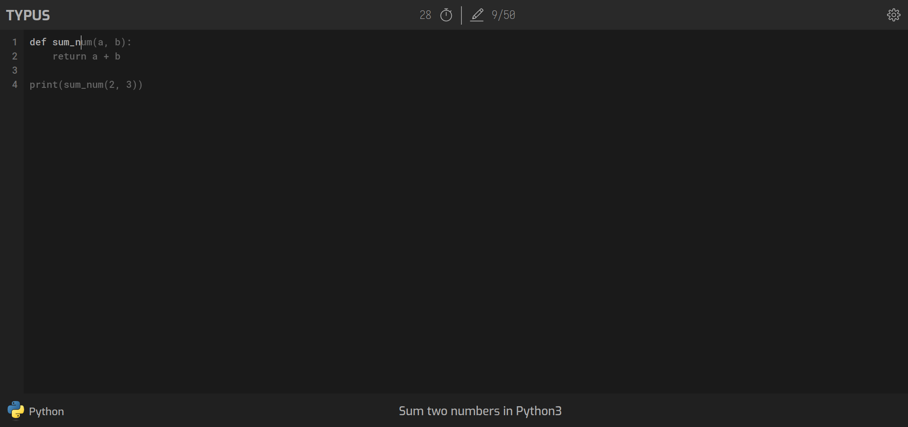

# Typus

Typus is a website created for practising quick code typing. No third-party frontend libraries are used, only React.js and SASS for styling.

## Preview

## Implemented features

- Typing one hardcoded code template (choosing different code samples will be implemented soon)
- Code highlighting on progress

## Ingredients

- [TypeScript React](https://reactjs.org/) - A library for building UIs
- [SASS](https://sass-lang.com/) - CSS extension for powerful styling